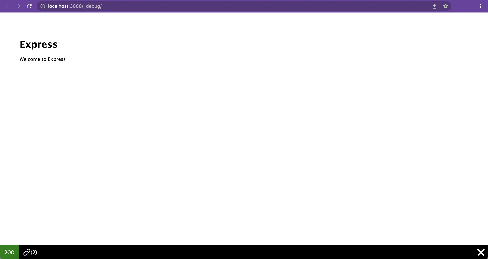
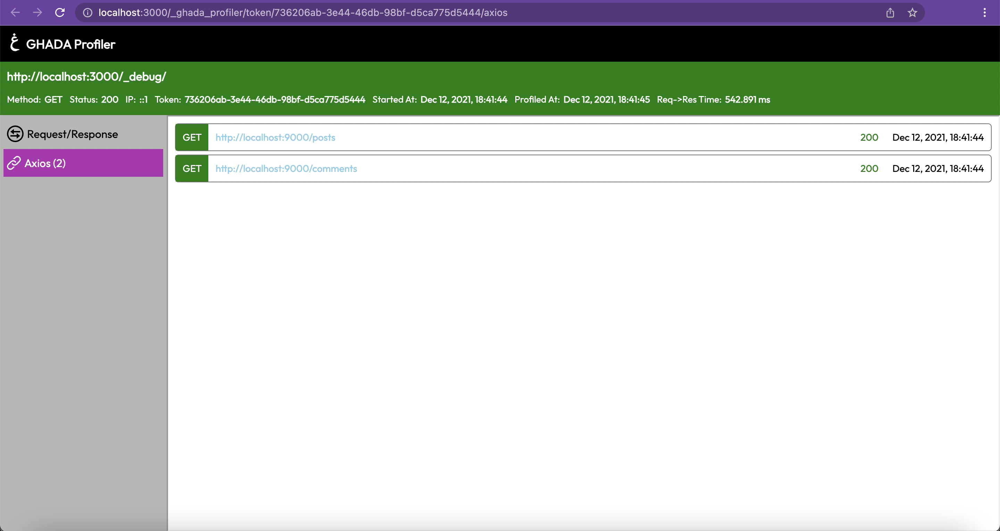

# Ghada Express Profiler Axios Scope

Axios scope for Ghada Express Profiler

## Works with

- Any version of `@ghadautopia/express-profiler`

## Dependencies

```package.json
"@ghadautopia/express-profiler": "^1.0.0",
"ejs": "^3.1.6",
"on-finished": "^2.3.0"
```

## Installation

Using npm

```sh
npm install @ghadautopia/express-profiler-axios
```

Or using yarn

```sh
yarn add @ghadautopia/express-profiler-axios
```

## Usage

Import `axiosScope` and `axiosStreamMiddleware` from `@ghadautopia/express-profiler-axios` and add them to Ghada Express Profiler configuration. As shown in the example below:

```node
// import axios
const { default: axios } = require('axios');
// import axiosScope instance and axiosStreamMiddleware
const { axiosScope, axiosStreamMiddleware } = require('@ghadautopia/express-profiler-axios');

// instantiate another axios instance
const axios2 = axios.create();

/**
 * during profiler inistantiation,
 * pass axiosScope in the scopes array, 
 * pass axiosStreamMiddleware in streamMiddlewares array and pass your axios instance to it
 */
profiler(app, {
  scopes: [
    ...  
    axiosScope,
    ...
  ],
  streamMiddlewares: [
    ...
    axiosStreamMiddleware(axios),
    axiosStreamMiddleware(axios2),
    ...
  ],
});
```

## How it works

`axiosStreamMiddleware` is used by axios scope stream to log data of each axios call

`axiosScope` is used for rendering axios slot in the toolbar and the axios scope view





## License

MIT
